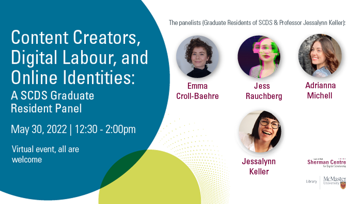

## Social Media and Digital Activism 

# "Content Creators, Digital Labour, and Online Identities: A SCDS Graduate Resident Panel" 

What role do social media platforms play in forming and negotiating digital labour? How do platforms frame online selves and lives as intelligible or otherwise? What are the cultural and communicative practices Creators and users rely on to mediate their identities in digital spaces?

At this virtual panel, Sherman Centre Graduate Residents will share their in-progress research and address these timely questions. Drawing from exciting interdisciplinary fields such as Cultural Studies, Feminist Media Studies, Automedia, and Human-Computer Interaction, the papers in this session consider the on and offline impacts of affective labour and attention economies, self-branding practices, and the mediation of identity.

Adrianna Michell analyzed the Twitter hashtag #PaidSickDaysSaveLives, where workers in Ontario, Canada, expressed concerns over government sick leave policies amidst the early months of the COVID-19 pandemic. Emma Croll-Baehre examined how twin content creators across diverse platforms articulate and mediate their digital selves and lives. Jess Rauchberg explored the communicative strategies that censored or "shadowbanned" disabled TikTok and Instagram Creators rely upon for platform engagement. Special guest Professor Jessalynn Keller (Communication, Media, and Film, University of Calgary) then joined the session for a formal response to the Graduate Residents' presentations.

# Watch a Recording of the Panel 

<iframe height="480" width="853" allowfullscreen frameborder=0 src="https://echo360.ca/media/4378b2ec-7d0c-4632-a1e4-5a8076a494da/public?autoplay=false&automute=false"></iframe>

View the original [here](https://echo360.ca/media/4378b2ec-7d0c-4632-a1e4-5a8076a494da/public).

# "Looking Back to Go Forward: Histories of Oppositional Feminist Politics & the Internet: A Guest Lecture by Dr. Jessalynn Keller" 

Recent feminist media studies scholarship has attended to the ways in which feminism’s current popularity is intertwined with the logics of digital media platforms and neoliberal capitalism. But, has it always been? And, does it have to be? This work-in-progress talk by special guest Professor Jessalynn Keller (Communication, Media, and Film, University of Calgary) considers the possibilities for oppositional feminist politics online across both contemporary and historical contexts.

Beginning with the recent case study of #WitchTheVote (based on a paper co-written with Alora Paulsen Mulvey), Professor Keller traces how some feminist Internet users are de-centering economies of visibility, large audiences, and easily consumable content through their use of nostalgic Internet practices. Keller puts this example in conversation with a historical case study from the early 2000s, brownfemipower’s blog. She considers this influential blog as emblematic of an intersectional feminist blogging community that actively critiqued the relationship between feminism, digital media, celebrity, and whiteness in the early days of web 2.0.

Taken together, these case studies highlight the need for further historical analysis of the feminist Internet, while illuminating how Internet practices have been at the crux of tensions and reworkings of feminisms for over two decades.

# Watch a Recording of the Guest Lecture

<iframe height="480" width="853" allowfullscreen frameborder=0 src="https://echo360.ca/media/4378b2ec-7d0c-4632-a1e4-5a8076a494da/public?autoplay=false&automute=false"></iframe>

View the original [here](https://echo360.ca/media/4378b2ec-7d0c-4632-a1e4-5a8076a494da/public).
