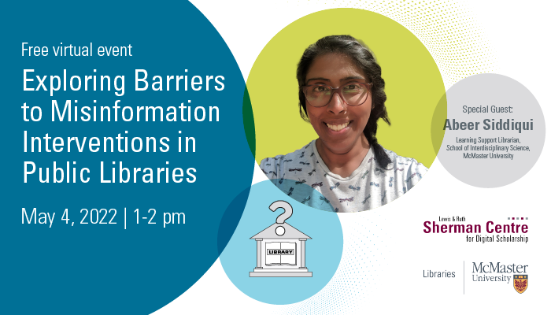

## Science Communication and Digital Scholarship

# I. Towards More Effective Science Communication with the Benefit of Digital Scholarship: A SCDS Graduate Resident Panel

How can scholars best communicate scientific analyses and results? How can we engage wider audiences in scientific research?

In this panel, three work-in-progress papers address these questions with a shared answer: digital tools. Through case studies of their own research, emerging scholars will explore the benefits of digital scholarship in science communication and discuss the importance of employing reflexive, inclusive, and interactive approaches.

The three projects discussed here highlight the diverse forms that digital scholarship and science communication can take. Cameron Anderson presents an interactive app that allows people to listen to scientific analysis of musical research. Duygu Ertemin introduces an interactive digital exhibit and StoryMap on prehistoric periods; her novel approach to analyzing archaeological materials enables diverse audiences to interact with the exhibition by pinning comments and sharing their own thoughts and stories. Finally, Brianne Morgan and Akacia Propst showcase a science blog entitled “The Null Hypothesis” where scholars can share their research stories with one another and the public to demystify the scientific process. The presentations were followed by a response by special guest respondent Abeer Siddiqui, Science Librarian and Adjunct Professor in the School of Interdisciplinary Science, as well as a Q&A period. 

# Watch a Recording of the Graduate Resident Panel

<iframe height="480" width="853" allowfullscreen frameborder=0 src="https://echo360.ca/media/4378b2ec-7d0c-4632-a1e4-5a8076a494da/public?autoplay=false&automute=false"></iframe>

View the original [here](https://echo360.ca/media/4378b2ec-7d0c-4632-a1e4-5a8076a494da/public).

# II. Exploring Barriers to Misinformation Interventions in Public Libraries: A Guest Lecture by Abeer Siddiqui

Misinformation has always been dangerous and divisive, but especially so in the wake of "fake news" and Covid-19 conspiracy theories. How can we, as scholars, librarians, and citizens, combat the spread of misinformation? What challenges might we encounter while doing this work?

We were delighted to host Abeer Siddiqui, a celebrated teacher with a record of empowering students and engaging communities, at this talk. Siddiqui will discuss her research on the challenges of addressing misinformation in public libraries and explore how her recent project informs her longstanding work on storytelling and science communication as a Learning Support Librarian and Adjunct Professor in the School of Interdisciplinary Science.

# Watch a Recording of Abeer Siddiqui's Guest Lecture 

<iframe height="480" width="853" allowfullscreen frameborder=0 src="https://echo360.ca/media/4378b2ec-7d0c-4632-a1e4-5a8076a494da/public?autoplay=false&automute=false"></iframe>

View the original [here](https://echo360.ca/media/4378b2ec-7d0c-4632-a1e4-5a8076a494da/public).
