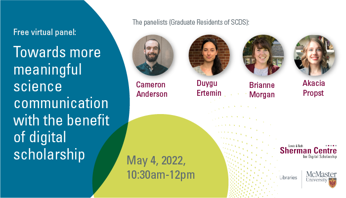

# Welcome to Science Communication and Digital Activism: 2022 SCDS Graduate Resident Events

Each year, the Sherman Centre's Graduate Residents are invited to conceptualize an event related to their research interests. In 2022, this resulted in a suite of four events: two panels where SCDS Graduate Residents shared their work-in-progress research and two guest lectures by speakers whose work intersected with the Residents' research interests. 

## Science Communication and Digital Scholarship

"Towards More Effective Science Communication with the Benefit of Digital Scholarship: A SCDS Graduate Resident Panel"

How can scholars best communicate scientific analyses and results? How can we engage wider audiences in scientific research?

In this panel, three work-in-progress papers address these questions with a shared answer: digital tools. Through case studies of their own research, emerging scholars will explore the benefits of digital scholarship in science communication and discuss the importance of employing reflexive, inclusive, and interactive approaches.

The three projects discussed here highlight the diverse forms that digital scholarship and science communication can take. Cameron Anderson presents an interactive app that allows people to listen to scientific analysis of musical research. Duygu Ertemin introduces an interactive digital exhibit and StoryMap on prehistoric periods; her novel approach to analyzing archaeological materials enables diverse audiences to interact with the exhibition by pinning comments and sharing their own thoughts and stories. Finally, Brianne Morgan and Akacia Propst showcase a science blog entitled “The Null Hypothesis” where scholars can share their research stories with one another and the public to demystify the scientific process. The presentations were followed by a response by special guest respondent Abeer Siddiqui, Science Librarian and Adjunct Professor in the School of Interdisciplinary Science, as well as a Q&A period. 

<b> "Exploring Barriers to Misinformation Interventions in Public Libraries: A Guest Lecture by Abeer Siddiqui" </b>

Misinformation has always been dangerous and divisive, but especially so in the wake of "fake news" and Covid-19 conspiracy theories. How can we, as scholars, librarians, and citizens, combat the spread of misinformation? What challenges might we encounter while doing this work?

We were delighted to host Abeer Siddiqui, a celebrated teacher with a record of empowering students and engaging communities, at this talk. Siddiqui will discuss her research on the challenges of addressing misinformation in public libraries and explore how her recent project informs her longstanding work on storytelling and science communication as a Learning Support Librarian and Adjunct Professor in the School of Interdisciplinary Science.

## Social Media and Digital Activism 

"Content Creators, Digital Labour, and Online Identities: A SCDS Graduate Resident Panel"

What role do social media platforms play in forming and negotiating digital labour? How do platforms frame online selves and lives as intelligible or otherwise? What are the cultural and communicative practices Creators and users rely on to mediate their identities in digital spaces?

At this virtual panel, Sherman Centre Graduate Residents will share their in-progress research and address these timely questions. Drawing from exciting interdisciplinary fields such as Cultural Studies, Feminist Media Studies, Automedia, and Human-Computer Interaction, the papers in this session consider the on and offline impacts of affective labour and attention economies, self-branding practices, and the mediation of identity.

Adrianna Michell analyzed the Twitter hashtag #PaidSickDaysSaveLives, where workers in Ontario, Canada, expressed concerns over government sick leave policies amidst the early months of the COVID-19 pandemic. Emma Croll-Baehre examined how twin content creators across diverse platforms articulate and mediate their digital selves and lives. Jess Rauchberg explored the communicative strategies that censored or "shadowbanned" disabled TikTok and Instagram Creators rely upon for platform engagement. Special guest Professor Jessalynn Keller (Communication, Media, and Film, University of Calgary) then joined the session for a formal response to the Graduate Residents' presentations.

"Looking Back to Go Forward: Histories of Oppositional Feminist Politics & the Internet: A Guest Lecture by Dr. Jessalynn Keller"

Recent feminist media studies scholarship has attended to the ways in which feminism’s current popularity is intertwined with the logics of digital media platforms and neoliberal capitalism. But, has it always been? And, does it have to be? This work-in-progress talk by special guest Professor Jessalynn Keller (Communication, Media, and Film, University of Calgary) considers the possibilities for oppositional feminist politics online across both contemporary and historical contexts.

Beginning with the recent case study of #WitchTheVote (based on a paper co-written with Alora Paulsen Mulvey), Professor Keller traces how some feminist Internet users are de-centering economies of visibility, large audiences, and easily consumable content through their use of nostalgic Internet practices. Keller puts this example in conversation with a historical case study from the early 2000s, brownfemipower’s blog. She considers this influential blog as emblematic of an intersectional feminist blogging community that actively critiqued the relationship between feminism, digital media, celebrity, and whiteness in the early days of web 2.0.

Taken together, these case studies highlight the need for further historical analysis of the feminist Internet, while illuminating how Internet practices have been at the crux of tensions and reworkings of feminisms for over two decades.

Proceed to the Recording page to watch recordings of all four events. 
