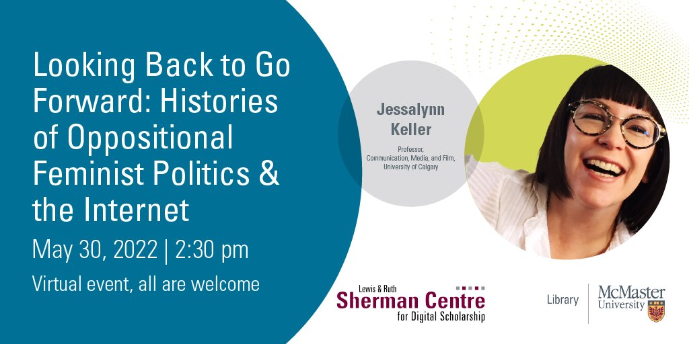

## II. Looking Back to Go Forward: Histories of Oppositional Feminist Politics & the Internet: A Guest Lecture by Dr. Jessalynn Keller

Recent feminist media studies scholarship has attended to the ways in which feminism’s current popularity is intertwined with the logics of digital media platforms and neoliberal capitalism. But, has it always been? And, does it have to be? This work-in-progress talk by special guest Professor Jessalynn Keller (Communication, Media, and Film, University of Calgary) considers the possibilities for oppositional feminist politics online across both contemporary and historical contexts.

Beginning with the recent case study of #WitchTheVote (based on a paper co-written with Alora Paulsen Mulvey), Professor Keller traces how some feminist Internet users are de-centering economies of visibility, large audiences, and easily consumable content through their use of nostalgic Internet practices. Keller puts this example in conversation with a historical case study from the early 2000s, brownfemipower’s blog. She considers this influential blog as emblematic of an intersectional feminist blogging community that actively critiqued the relationship between feminism, digital media, celebrity, and whiteness in the early days of web 2.0.

Taken together, these case studies highlight the need for further historical analysis of the feminist Internet, while illuminating how Internet practices have been at the crux of tensions and reworkings of feminisms for over two decades.

## Watch a Recording of Dr. Jessalynn Keller's Guest Lecture

<iframe height="480" width="853" allowfullscreen frameborder=0 src="https://echo360.ca/media/033b5641-caca-4fdc-842f-3b435edbaa05/public"></iframe>

View the original [here](https://echo360.ca/media/033b5641-caca-4fdc-842f-3b435edbaa05/public).

